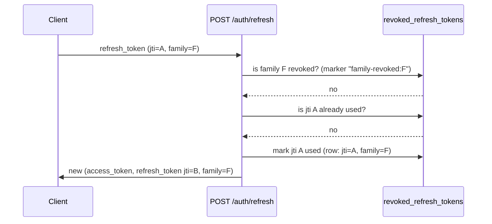
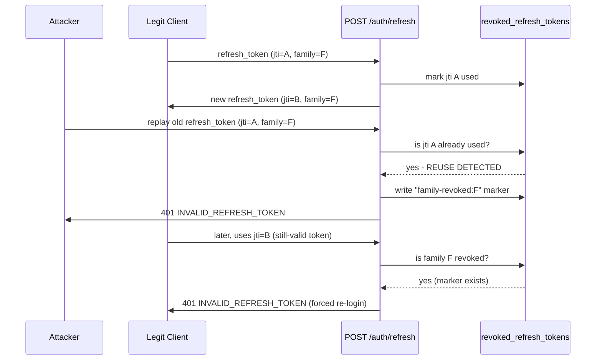

# Refresh Token Rotation & Reuse Detection (issue #179)

No diagram existed for this despite the logic being fairly intricate
(`app/services/auth_service.py:87-190`, issue #125). This documents the actual current
behavior, verified against that code — not a target/aspirational design.

## Normal rotation

Every `POST /auth/refresh` call **replaces** the presented refresh token with a new one in
the same `family_id`; the old token is marked used and can never be redeemed again.

## Reuse detected (theft indicator)

If a refresh token that was **already rotated away** (its `jti` is already marked used) is
presented again — the signature that a token was stolen/leaked and both the attacker and the
legitimate client are now racing — the **entire family** is revoked, not just that one token.
Every other token sharing `family_id`, including ones never individually recorded, becomes
invalid via the single `family-revoked:{family_id}` marker row.

Note the cost of this design: the *legitimate* client also gets logged out once reuse is
detected, even though it did nothing wrong — this is a deliberate trade-off (favoring "force
re-login on suspected theft" over "let the legitimate session continue"), not an oversight.

## Logout

`POST /auth/logout` decodes the **access token** (not a refresh token) to recover its
`family_id` and revokes that family directly — same `revoke_refresh_family` path as the reuse
case above, just triggered intentionally rather than by a reuse signal.

## Not yet diagrammed

A full entity-relationship diagram across the closed-loop's ~15 models (`Dataset` →
`DatasetVersion` → `TrainingRun` → `ModelVersion` → `PromotionDecision` → `Deployment`, plus
`User`, `EvalSet`, `ComputeResource`, etc.) was intentionally left out of this pass — it
deserves its own careful verification against every FK in `app/models/`, not a rushed
addition alongside this narrower auth-flow diagram.
